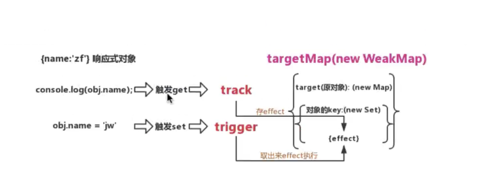

# VUE3.0

学习并实现[vue3.0](https://github.com/vuejs/vue-next)

## VUE2.0实现思路

- 数据劫持
  - 使用`Object.defineProperty`和**递归**实现。
  - 不足
    - 当数据层级较深时：递归次数会变多，可能存在内存泄露，进而影响性能。
    - 对象不存在的属性不能被拦截
- 处理数组
  - 需要重写**数组**原型上的方法（原地修改的方法：`push/pop/sort/reverse/splice`）
  - 使用`AOP`的思想重写，在执行原方法的同时，执行更新视图的操作函数
  - 不足
    - 数组改变length会无效，因为内部没做watch
- 依赖收集
  - 在编译阶段，模板生成的是一个字符串，
  - 当模板中有用到某个变量时，会使用正则去匹配这个双大括号并用`this.$data`去替换对应的变量
    - 与此同时，将这个变量使用`watcher`进行监听
      - 当页面呈现时会取到这个值，于是触发`数据劫持`部分的`getter`将其放入发布订阅机制的`deps`依赖中，页面可能多处调用，因此使用队列维护
      - 当在代码中设置这个值时，会触发`数据劫持`部分的`setter`将执行这个`发布订阅实例`的`notify`发布方法去调用每个`watcher`的`update`更新方法去更新视图
      - `watcher`的`update`更新方法就是操作`dom`
- 代理`$data/computed/watch/methods`
  - 使用`Object.defineProperty`的`getter`实现取值代理
  
## VUE3.0实现思路

> 建议先看单元测试`test tell everything`，知道具体功能后，思考如果是自己会如何实现，然后再看源码。

- 数据劫持
  - 使用`Proxy`和`Reflect`实现
    - 优势
      - 对象不存在的属性能被拦截
      - 不是一上来就就行递归数据劫持，而是在get中**按需递归**：当层级较深的对象赋值时再去递归取值再赋值  
      - 使用`Reflect`的`set`有返回值去告知是否设置成功，弥补直接赋值时`writable=false`的情况下不会报错也不成功的问题
      - `Reflect`主要作用是取代`Object`上的方法
    - 缺点
      - 兼容性比较差 ie11都不支持
  - 避免多次调用`Proxy`
    - 使用`WeakMap`映射表做缓存
      - 如果代理过直接返回代理后的对象
      - 如果对象就是已经代理后的，不用再次代理，直接返回即可
- 处理数组
  - 不需要重写原型上的方法，`Proxy`能监听数组的变化
  - 当调用原型上原地修改的方法(`push/pop/sort/reverse/splice`)时，会先操作数据，然后更改数组的`length`属性（这是无意义的修改，不应该再次渲染视图），所以屏蔽的方式是将新值和旧值对比，如果没修改且数组长度没变化就不去渲染视图
- 依赖收集
  - 
  - 利用js是单线程的特性
    - 目标：在调用`effect`方法时，传参是一个函数，首先会立即执行一次，当函数内部的`reactive`数据变化时，会再次触发这个函数。
    - 实现：在`effect`内部会先执行一次传参的函数，由于js单线程特性，会执行其中代码，
      - 若含有`reactive`的数据在取值时会走`Proxy`的`getter`，此时去对依赖进行收集，收集的方式是维护一个`WeackMap`，其键为原对象，值为一个`Map`去存放原对象上的每个`key`，这个`Map`的键为原对象的`key`，值为一个`Set`去存放所有依赖的`effect`的传参函数；
      - 当在改变已`reactive`的对象的某个键值时，会触发`Proxy`的`setter`，此时直接对上面依赖收集时维护的`WeackMap`直接取值，去遍历执行对应`effect`函数。
  - 几个问题
    - 为什么使用`WeakMap`而不直接使用`Map`？
      - 移步[Why WeakMap](https://developer.mozilla.org/zh-CN/docs/Web/JavaScript/Reference/Global_Objects/WeakMap)
        - `Node`垃圾回收机制
          - 参考资料[深入理解Node.js垃圾回收与内存管理](https://www.jianshu.com/p/4129a3fce7bb)
          - 引用计数 - 新生代
          - 老生代 
            - 标记清除(Mark-Sweep)：执行函数时，会有进入环境和离开环境，将变量进行标记，最后将没有标记的变量进行清除
              - 优点：快
              - 缺点：形成内存碎片，浪费空间
            - 标记整理(Mark-Compact)：将引用计数>0的变量移动到内存空间的一端，将引用计数=0的变量移动内存空间的另一端，最后清除另一端的所有变量
              - 优点：不会形成内存碎片，充分利用内存
              - 缺点：比较慢
            - 增量标记(Mark-Increment)：是对标记整理的优化，让整理的过程进行分割，比如每标记整理十个变量就不占用空间去执行一段代码，然后再标记整理；将标记整理需要很长一段时间的缺点进行分割到每个非常小的时间段。

## 总结
